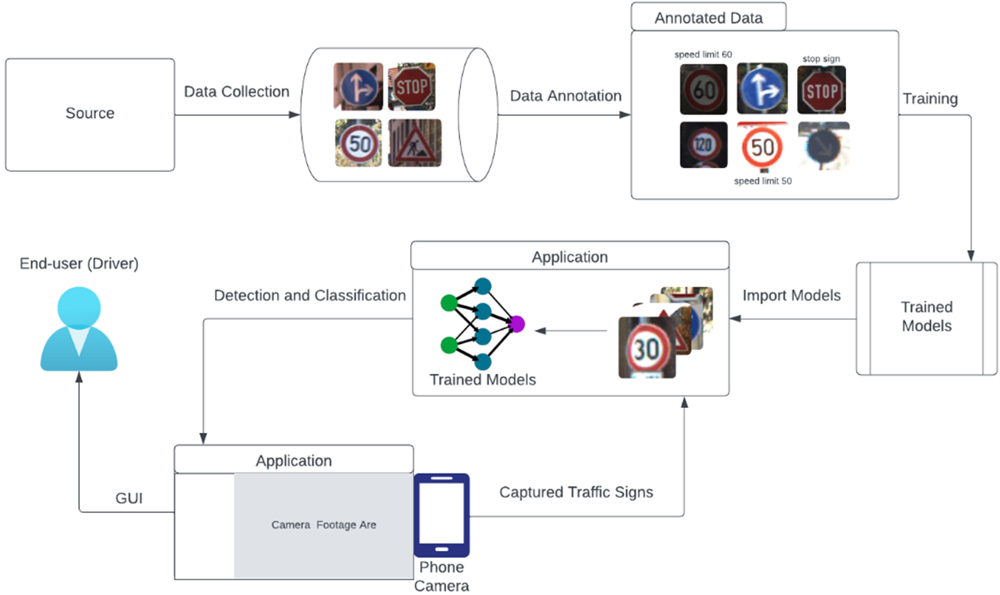
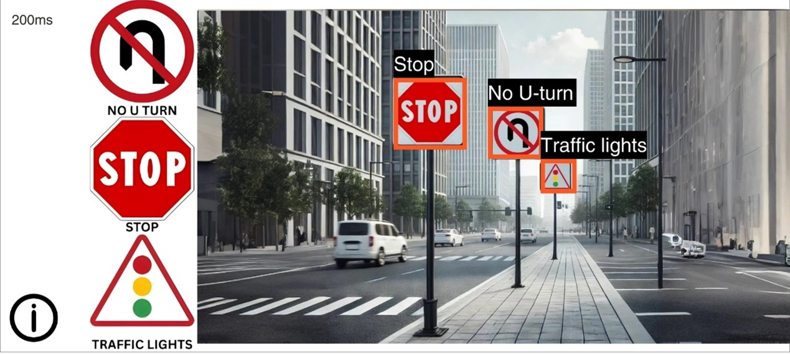

# Sign Sense - Real-Time Mobile App Traffic Sign Recognition

This repository contains the source code, models, and resources for the research project titled **"Real-Time Mobile App Traffic Sign Recognition with YOLOv10 and CNN for Driving Education"**.

**Sign Sense** is a real-time mobile application for traffic sign recognition developed to enhance road safety. By leveraging Convolutional Neural Networks (CNNs) and TensorFlow Lite, the app detects and classifies traffic signs in real-time using Android devices.

The system is designed to provide an accessible and cost-effective alternative to high-end Advanced Driver Assistance Systems (ADAS), specifically tailored to recognize traffic signs in the Philippines. It aims to increase driver awareness, reduce traffic violations, and contribute to safer roadways.

**Abstract:**

> This study presents a novel Traffic Sign Recognition system for Android devices, employing Convolutional Neural Networks (CNNs) and the YOLOv10 architecture for real-time detection and classification of Philippine traffic signs. The application improves road safety by providing auditory and visual cues for traffic sign compliance, especially in the context of driving education. The system integrates TensorFlow Lite (TFLite) to optimize performance for resource-constrained mobile platforms. The study encompasses data collection, annotation, preprocessing, model development, hyperparameter tuning, model training, model evaluation, and application development. The detection model achieved high accuracy with a mean Average Precision (mAP) of 0.823 and 99.66% accuracy for the classification model. The developed mobile app also demonstrated effective real-time recognition capabilities with a recognition inference time of 200-300ms. Challenges such as low-light performance are identified, with recommendations for future enhancements in data balancing, nighttime functionality, and multilingual feedback. This scalable, cost-effective system bridges the accessibility gap in advanced driver assistance technologies, offering the potential for wider regional adaptation.

*Keywords*: Driving Education, Computer Vision, Machine Learning, Deep Learning with Convolutional Neural Networks, Mobile App Development

**Read the full paper**: [DOI: 10.5121/ijcsitce.2025.12201](https://doi.org/10.5121/ijcsitce.2025.12201)

## Features

- **Real-Time Traffic Sign Detection**: Identifies traffic signs on the road using YOLOv10 for fast and efficient object detection.
- **Traffic Sign Classification**: Classifies detected traffic signs into 15 categories using a CNN-based model.
- **Mobile-Optimized Models**: Models are converted to TensorFlow Lite (TFLite) for seamless deployment on Android devices.
- **User Feedback**: Provides audio feedback and displays labeled bounding boxes for recognized traffic signs.
- **Scalable System**: Supports easy updates for detection and classification models independently.
- **Localized for the Philippines**: Recognizes 15 traffic sign classes mandated by the Philippine Land Transportation Office (LTO).

## Technologies Used

- **YOLOv10**: Used for training the traffic sign detection model.
- **TensorFlow**: Used for training the traffic sign classification model.
- **TensorFlow Lite**: Enables lightweight, efficient model deployment on Android devices.
- **Kotlin and Android Studio**: For developing the mobile application.
- **Roboflow**: For managing and annotating datasets.

## Project Structure

This repository is organized as follows:

- **`app/`**: Contains the source code for the Android application, including Gradle and Kotlin files for app development.
- **`models/`**: Contains the development files and Jupyter notebooks for the classification and detection models.

The figure below illustrates the system architecture of the Traffic Sign Recognition (TSR) application, detailing the flow from data collection to user interaction.

The system begins with the Source, where traffic sign images are gathered. These images undergo Data Annotation, creating labeled datasets with bounding boxes for detection and cropped images for classification organized in subfolders. The annotated data is then used for model training, resulting in Trained Models for detection and classification.

In the application phase, the Phone Camera captures live traffic sign images, which are processed by the Application. The trained models integrated into the application perform real-time detection and classification, highlighting detected signs with bounding boxes and labels on the interface. The system also incorporates a GUI for user interaction and feedback. Finally, the application provides processed results to the End User (Driver), enhancing road safety by delivering real-time visual and auditory information about recognized traffic signs.

## Datasets

The dataset includes over 48,000 images of Philippine traffic signs, collected from public sources (Kaggle, Roboflow Universe), Google Street View, and manual captures. It covers 15 official traffic sign classes mandated by the Philippine Land Transportation Office (LTO).

1. **[Classification Dataset](https://drive.google.com/file/d/1rt8vEK9CzDxnaPcleClTAlx7OgPRCDaA/view?usp=drive_link):** 28,316 images were collected for the classification model.
2. **[Detection Dataset](https://universe.roboflow.com/my-workspace-ozcmx/traffic-sign-detection-vnb4u/):** 20,000 images were collected for the detection model.

## Setup and Installation

To set up and run this project locally, follow these steps:

1. Open Android Studio.
2. Select **File > Open** and navigate to the `app` directory of the cloned repository.
3. Allow Android Studio to sync the Gradle files.
4. Configure the emulator or connect a physical device for testing.
5. Run the application to build and deploy it on your device.

## Usage

1. **Run the Android Application**:
   - Launch the app on the connected Android device or emulator.
   - Allow necessary permissions (e.g., camera access) when prompted.

2. **Real-Time Traffic Sign Recognition**:
   - Point the device's camera toward a road or traffic signs.
   - The app will detect traffic signs in real-time and display the results on-screen, including labels, bounding boxes, and audio feedback.

3. **Test the App**:
   - Use sample traffic sign images or real-world traffic signs to test the recognition functionality.
   - Review performance metrics like recognition inference time displayed in the app.

4. **Explore the Code**:
   - Visit the `recognition-models` directory for notebooks and files related to classification and detection model development.
   - Explore the `data` directory to view the datasets used for training and testing.

5. **Customize**:
   - Modify the models or datasets as needed and retrain using the provided scripts and notebooks.

## Citation

You may use the following BibTeX entry for citation.

    @article{Gangoso2025TrafficSignRecognition,
        author    = {Gangoso, Earl Peter and Aca-ac, Rolando John and Sarabia, Patrick Zane},
        title     = {Real-Time Mobile App Traffic Sign Recognition with YOLOv10 and CNN for Driving Education},
        journal   = {International Journal of Computer Science, Information Technology and Control Engineering (IJCSITCE)},
        volume    = {12},
        number    = {2},
        year      = {2025},
        pages     = {01--15},
        doi       = {10.5121/ijcsitce.2025.12201},
        url       = {https://doi.org/10.5121/ijcsitce.2025.12201}
    }
